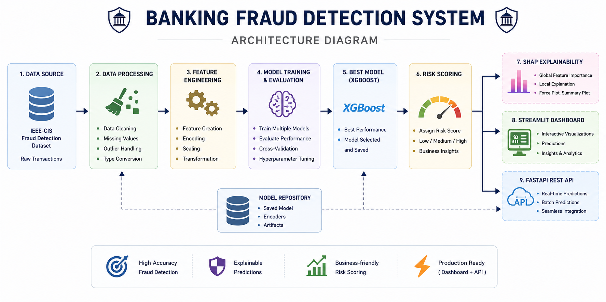
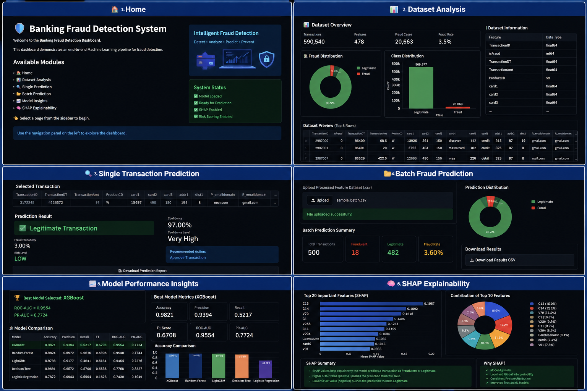

<p align="center">
  
</p>

<h1 align="center">🏦 Banking Fraud Detection System</h1>

<p align="center">
An end-to-end Machine Learning application for detecting fraudulent banking transactions using the IEEE-CIS Fraud Detection dataset.
</p>

<p align="center">


</p>

---

# 📌 Project Overview

Financial institutions process millions of transactions every day, making fraud detection a challenging task due to highly imbalanced datasets and constantly evolving fraud patterns.

This project develops an end-to-end fraud detection pipeline capable of identifying suspicious banking transactions using Machine Learning while providing interpretable predictions through SHAP explainability.

The project includes:

- 📊 Data Cleaning & Feature Engineering
- 🤖 Multiple Machine Learning Models
- 🏆 Automatic Best Model Selection
- 🧠 SHAP Explainability
- 📈 Interactive Streamlit Dashboard
- ⚠ Business Risk Scoring
- 🔍 Single Transaction Prediction
- 📂 Batch Transaction Prediction
- ⚡ FastAPI REST API

---

# 🚀 Features

✅ End-to-End Machine Learning Pipeline

✅ Feature Engineering on Banking Transactions

✅ Comparison of Multiple Classification Models

- Logistic Regression
- Decision Tree
- Random Forest
- LightGBM
- XGBoost

✅ Best Model Selection

✅ Fraud Probability Prediction

✅ Business Risk Scoring

✅ SHAP Explainability

✅ Interactive Visualizations

✅ Batch Prediction

✅ REST API using FastAPI

---

# 🏗️ System Architecture

<p align="center">

</p>

---

# 📸 Dashboard Preview

<p align="center">

</p>

---

# 🛠️ Tech Stack

### Programming Language

- Python

### Machine Learning

- Scikit-Learn
- XGBoost
- LightGBM

### Data Analysis

- Pandas
- NumPy

### Visualization

- Plotly
- Matplotlib

### Dashboard

- Streamlit

### Explainability

- SHAP

### Backend API

- FastAPI

### Model Serialization

- Joblib

---

# 📂 Dataset

**Dataset Used**

IEEE-CIS Fraud Detection Dataset

The dataset contains over **590,000 banking transactions** along with customer, card, device, email, and transaction-related features.

Target Variable

| Value | Meaning |
|------|---------|
| 0 | Legitimate Transaction |
| 1 | Fraudulent Transaction |

---

# ⚙️ Machine Learning Workflow

```
Raw Dataset
      │
      ▼
Data Cleaning
      │
      ▼
Feature Engineering
      │
      ▼
Model Training
      │
      ▼
Model Evaluation
      │
      ▼
Best Model Selection
      │
      ▼
SHAP Explainability
      │
      ▼
Risk Scoring
      │
      ▼
Streamlit Dashboard
      │
      ▼
FastAPI Deployment
```

---

# 📊 Model Performance

The following Machine Learning models were evaluated:

| Model | Accuracy | ROC-AUC | PR-AUC |
|---------|----------|---------|---------|
| XGBoost | **98.21%** | **0.9554** | **0.7724** |
| Random Forest | 98.24% | 0.9540 | **0.7744** |
| LightGBM | 97.98% | 0.9454 | 0.7276 |
| Decision Tree | 96.91% | 0.7768 | 0.3327 |
| Logistic Regression | 78.72% | 0.7430 | 0.1049 |

**Final Model Selected:** **XGBoost**

Selection was based on a strong balance between ROC-AUC, Precision, Recall, and F1 Score.

---

# 🧠 SHAP Explainability

To improve model transparency and interpretability, SHAP (SHapley Additive Explanations) is integrated into the project.

The explainability module provides:

- Global Feature Importance
- Top Influential Features
- Business Interpretation
- Contribution Analysis
- Fraud Driver Identification

This enables users to understand **why** a transaction is predicted as fraudulent rather than relying on black-box predictions.

---

# 💻 Streamlit Dashboard

The application contains six interactive modules:

### 🏠 Home

- Project Overview
- Workflow
- Dataset Summary

### 📊 Dataset Analysis

- Dataset Preview
- Fraud Distribution
- Transaction Analysis
- SHAP Feature Importance

### 🔍 Single Prediction

- Predict Fraud for One Transaction
- Fraud Probability
- Confidence Score
- Risk Level
- Download Prediction Report

### 📂 Batch Prediction

- Upload CSV
- Predict Multiple Transactions
- Download Results

### 📈 Model Insights

- Model Comparison
- Accuracy
- ROC-AUC
- Precision
- Recall
- PR-AUC
- Feature Importance

### 🧠 SHAP Explainability

- Top Important Features
- SHAP Summary
- Business Interpretation
- Explainability Dashboard

---

# ⚡ FastAPI

Run the API

```bash
uvicorn api.api:app --reload
```

Swagger Documentation

```
http://127.0.0.1:8000/docs
```

---

# 📁 Project Structure

```
FDS/
│
├── api/
├── assets/
├── data/
│   ├── raw/
│   └── processed/
│
├── models/
├── notebooks/
├── pages/
├── utils/
│
├── app.py
├── requirements.txt
├── README.md
├── LICENSE
└── .gitignore
```

---

# ⚙️ Installation

Clone the repository

```bash
git clone https://github.com/YOUR_GITHUB_USERNAME/banking-fraud-detection-system.git

cd banking-fraud-detection-system
```

Install dependencies

```bash
pip install -r requirements.txt
```

Run the Streamlit dashboard

```bash
streamlit run app.py
```

---

# 🔮 Future Improvements

- Docker Deployment
- Cloud Deployment (AWS / Azure / GCP)
- Real-Time Streaming Fraud Detection
- Continuous Model Retraining
- MLflow Experiment Tracking
- CI/CD Pipeline
- Authentication for Dashboard & API

---

# 👨‍💻 Author

**Veer Jariwala**

Electronics & Communication Engineering  
National Institute of Technology, Tiruchirappalli

GitHub:

https://github.com/YOUR_GITHUB_USERNAME

---

# 📜 License

This project is licensed under the **MIT License**.